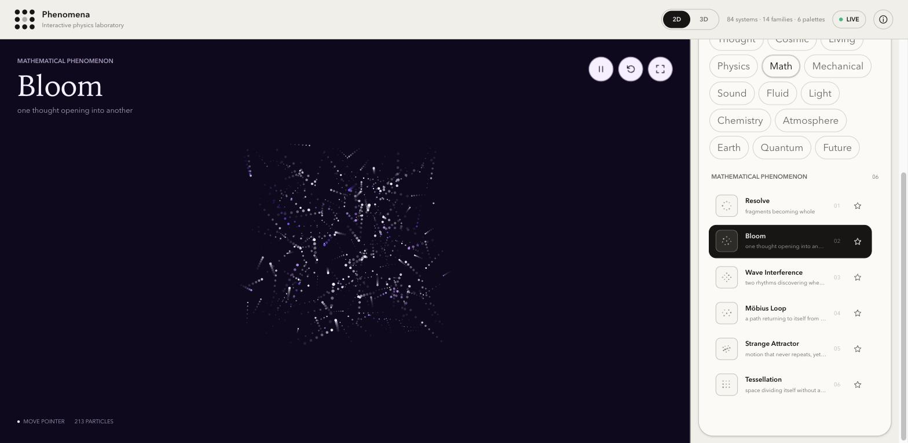
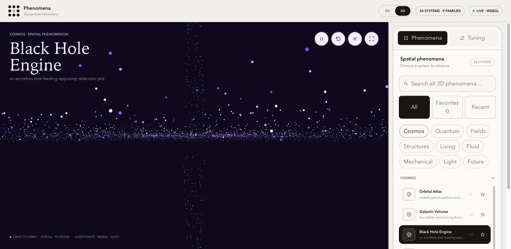

# Phenomena

An interactive gallery of 84 generative particle and physics simulations — spanning thought, cosmic, living, physical, mathematical, mechanical, acoustic, fluid, optical, chemical, atmospheric, earth, quantum, and future systems — rendered on canvas, with a control panel for tuning speed, density, palette, and pointer interaction live.

A separate 3D Lab adds 34 Three.js particle scenes across Cosmos, Quantum, Fields, Structures, Living, Fluid, Mechanical, Light, and Future, with drag-to-orbit, drag-to-pan, zoom, fullscreen, density, speed, point-size, and palette controls.

<p align="center">
  
  
</p>

## Tech stack

React 19, Vite, Three.js, Tailwind CSS, Radix UI, and Motion — no external state management library; canvas/WebGL renderers are driven imperatively by `requestAnimationFrame`.

## Quick start

```bash
npm install
npm run dev      # start the dev server
npm run build    # production build
npm run preview  # preview the production build
npm run lint      # lint the codebase
```

Requires Node 20+.

## Pages

This is a Vite multi-page app with three entry points:

| Route | Entry | Description |
| --- | --- | --- |
| `/` | `src/landing-main.jsx` → `LandingApp.jsx` | Landing page with a 2D/3D lab picker |
| `/gallery.html` | `src/main.jsx` → `App.jsx` | The 84-mode 2D particle gallery |
| `/spatial.html` | `src/spatial-main.jsx` → `SpatialApp.jsx` | The 34-scene 3D particle lab |

## Project structure

```
src/
  App.jsx, LandingApp.jsx, SpatialApp.jsx   # top-level app shells per entry point
  components/                                # shared UI chrome (controls, panels, icons)
  config/                                    # studio.js / spatial.js — modes, palettes, settings
  lib/                                       # persistence, deep-linking, shared helpers
  simulations/                               # canvas/WebGL renderers, one per simulation family
```

See `CLAUDE.md` for the full architecture write-up: how the generic particle router works, the dedicated (non-router) simulations, state flow, and canvas rendering conventions to follow when adding or touching a renderer.

## Adding a new mode

1. Add an entry to `MODES` in `src/config/studio.js`.
2. For most modes, add a branch or a `get*Target` function in `src/simulations/particleTargetRouter.js` / `particleTargets.js` — the shared canvas renderer will pick it up automatically.
3. For a mode complex enough to need its own rendering approach (like `fireworks`, `cymatics`, `levitation`), build a dedicated component and wire it into `App.jsx`.

See `CONTRIBUTING.md` for the full dev workflow.

## Status

This is an actively developed project, not a finished/polished 1.0. Known rough edges include particle hierarchy/pacing, mode transitions, pointer physics, trail/network restraint, and idle rendering.

## License

Source is public for viewing and reference. All rights reserved — no license is granted to reuse, redistribute, or modify this code. If you'd like to use any part of it, open an issue or reach out first.
